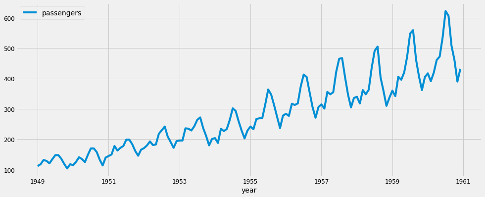
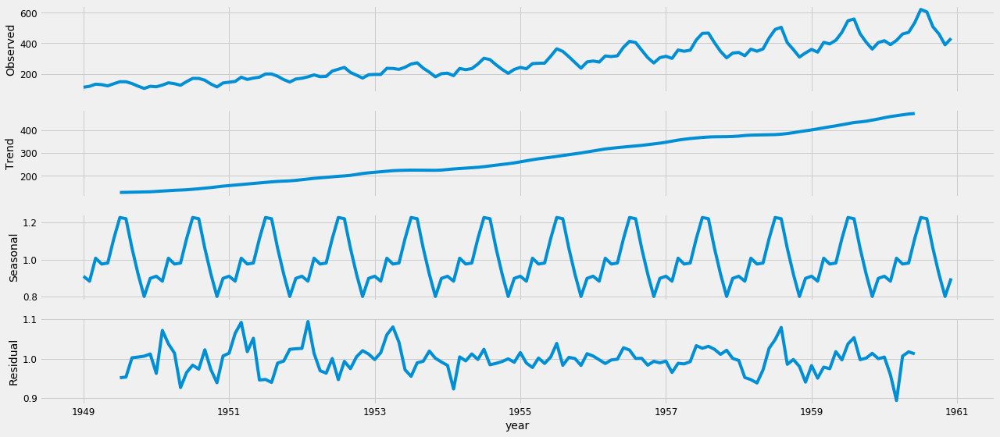
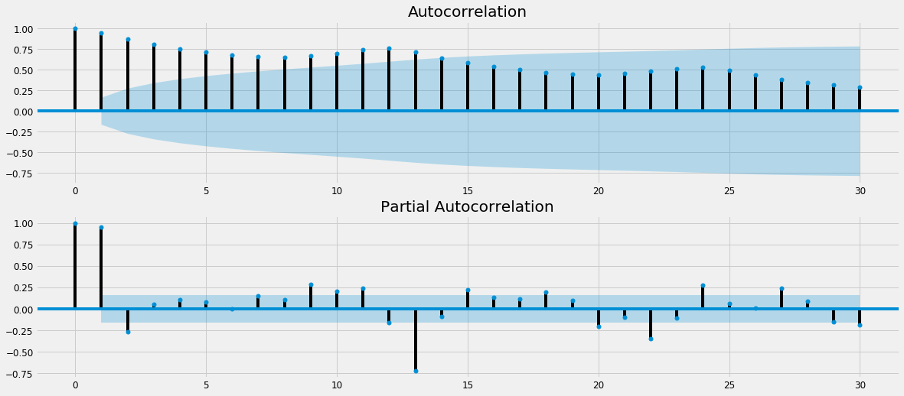
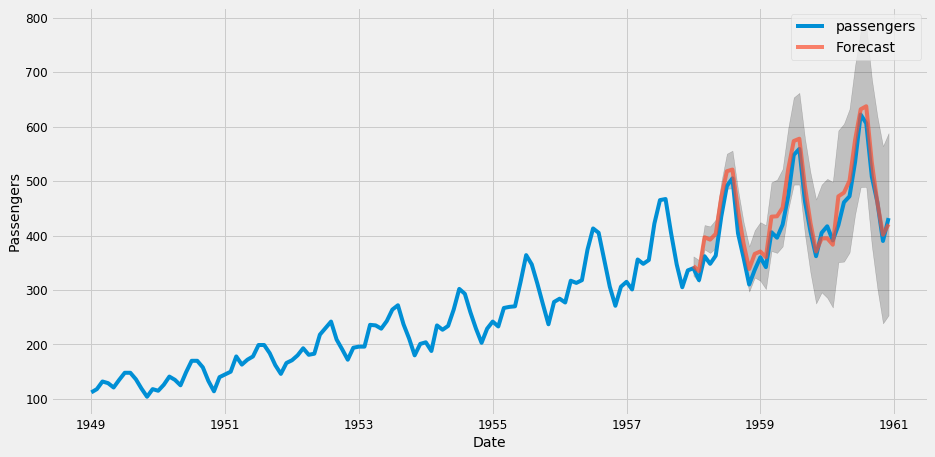
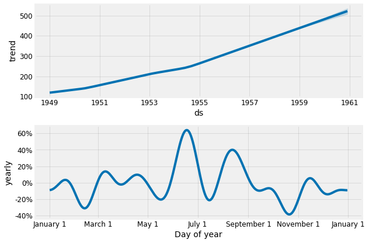

# ⏳ Time Series Analysis & Forecasting in Python

> **Comprehensive end-to-end time series forecasting project** using Python — from data preprocessing & stationarity checks to advanced modeling (ARIMA, SARIMA, Prophet) and performance evaluation.

---

## 📌 Project Overview
This project demonstrates **how to forecast airline passenger traffic** using different time series models.  
It includes **data preprocessing, trend & seasonality analysis, stationarity transformation, model training, and evaluation**.

The dataset used is the **International Airline Passengers dataset** (`international-airline-passengers.csv`).

---

## 📂 Project Structure

---

## 📊 Dataset
- **Name:** International Airline Passengers
- **Description:** Monthly total of international airline passengers from 1949 to 1960.
- **Source:** Public time series dataset

---

## 🛠️ Technologies & Libraries
- **Python** (Pandas, NumPy)
- **Visualization:** Matplotlib, Seaborn
- **Statistical Modeling:** statsmodels
- **Forecasting:** ARIMA, SARIMA, SARIMAX, Prophet
- **Evaluation Metrics:** MSE, RMSE, MAPE

---

## 📈 Key Steps in the Project

### 1️⃣ Data Preprocessing & Exploration
- Loaded and inspected dataset
- Converted dates to datetime format
- Checked for missing values
- Visualized raw time series data

### 2️⃣ Stationarity & Transformation
- **Rolling Statistics**
- **Augmented Dickey-Fuller Test (ADF)**
- **Log transformations**
- **Differencing**
- **Seasonal decomposition**

### 3️⃣ Model Building & Forecasting
- **AR (Autoregression)**
- **MA (Moving Average)**
- **ARMA**
- **ARIMA**
- **SARIMA / SARIMAX**
- **Prophet by Facebook**

### 4️⃣ Model Evaluation
- Forecast accuracy with RMSE, MSE, MAPE
- Comparing predictions with actual data
- Visualization of forecast trends

---

## 📷 Key Visuals

**1) Raw Series (Trend + Seasonality)**  

**2) Seasonal Decomposition (Multiplicative)**  

**3) ACF & PACF**  

**4) Forecast vs Actuals (Confidence Intervals)**  

**5) Prophet Components (Trend & Yearly Seasonality)**  

---

## 📌 Results & Insights

✅ Identified strong seasonal patterns in airline passenger data

✅ Achieved low RMSE with tuned SARIMA & Prophet models

✅ Demonstrated the importance of stationarity in time series modeling

✅ Showcased a reproducible forecasting pipeline
